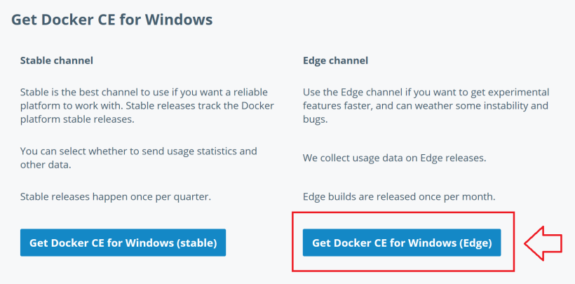
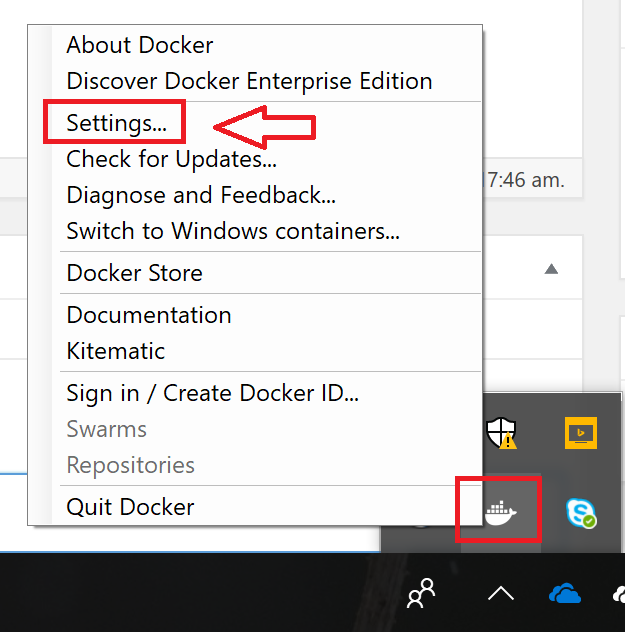
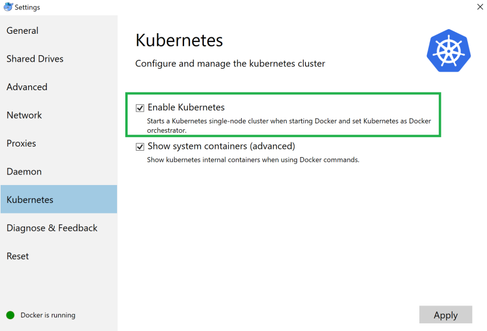
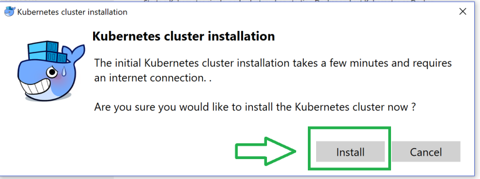
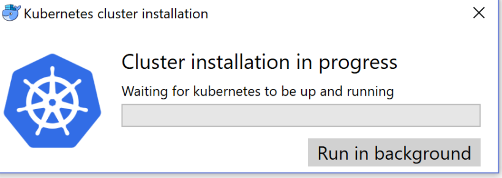
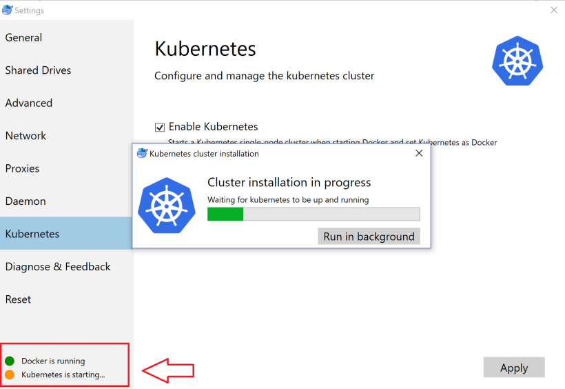
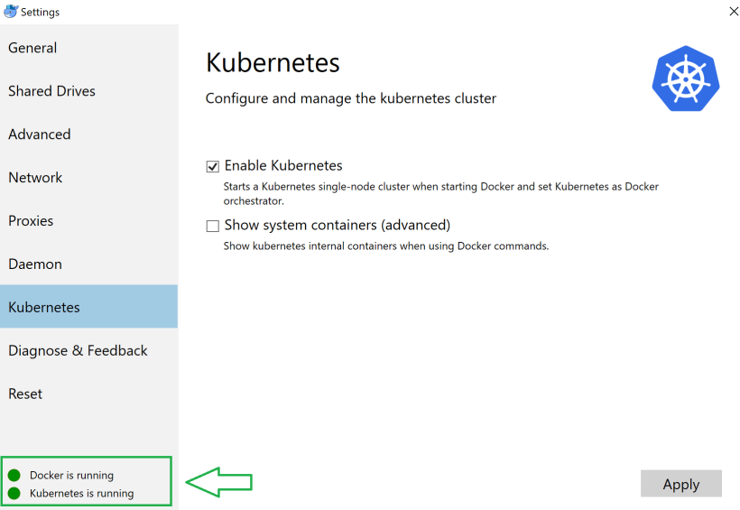

# Installation Steps

## Install Docker for Windows Edge

[Install](https://docs.docker.com/docker-for-windows/install/)



## Enable Kubernetes in Docker 













## Install Kubernetes Addons

**UI Dashboard**

```bash
$ kubectl apply -f https://raw.githubusercontent.com/kubernetes/dashboard/master/src/deploy/recommended/kubernetes-dashboard.yaml
```

```bash
$ kubectl proxy
```

Now access Dashboard at: http://localhost:8001/ui

Note: You can skip authorization.

**Monitoring**

```bash
$ kubectl apply -f https://raw.githubusercontent.com/kubernetes/kops/master/addons/monitoring-standalone/v1.7.0.yaml
```

## Build Docker Images

Build author

```bash
$ cd author_aem6.2_vanilla
$ docker image build -t aem/aem-author:latest .
```

Build publisher

```bash
$ cd publisher_aem6.2_vanilla
$ docker image build -t aem/aem-publisher:latest .
```

## Deploy to Kubernetes

Deploy author and expose service

```bash
$ kubectl run aem-author --image=aem/aem-author:latest --port=4502 --image-pull-policy=Never
$ kubectl expose deployment aem-author --type=LoadBalancer
```

Now access Author at: http://localhost:4502

Deploy publisher and expose service

```bash
$ kubectl run aem-publisher --image=aem/aem-publisher:latest --port=4503 --image-pull-policy=Never
$ kubectl expose deployment aem-publisher --type=LoadBalancer
```

Now access Publisher at: http://localhost:4503